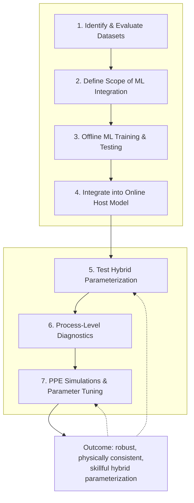

# Start Here: The General ML-Parameterization Workflow

This is the team's standard workflow for building a hybrid (physics + ML)
parameterization into CESM. It was first laid out for the convection trigger
project, but the seven stages generalize to any process — microphysics,
boundary-layer turbulence, gravity wave drag, etc. 

## 1. Identify & evaluate datasets

Select the training and benchmarking datasets the ML component will learn
from and be judged against. Evaluate each candidate for data quality,
variable coverage, resolution, and how representative it is of the regimes
CESM needs to get right.

*Convection example: TOOCAN (satellite-tracked mesoscale convective systems),
ClimSim, high-resolution simulations (e.g. DYAMOND runs).*

## 2. Define the scope of ML integration

Decide explicitly what part of the target parameterization scheme the ML
model will replace or augment — don't leave this implicit. Typical options:

- A specific sub-process (e.g. convective triggering, cloud height/depth)
- A specific tendency term (heating, moistening)
- The full parameterization scheme

The narrower the scope, the easier steps 4–7 are; be able to justify the
choice in the sub-project's `APPROACH` section.

## 3. Develop an offline ML training & testing framework

Standard supervised-learning loop: Training Data → ML Model Training →
Validation & Testing. Evaluate performance with metrics appropriate to the
target (e.g. RMSE, Bias, correlation) and always compare against the
existing baseline parameterization, not just against a held-out split. A
model that doesn't clearly beat the physics-based baseline offline isn't
ready to couple.

## 4. Integrate into the online host model

Wrap the best-performing offline model for inference from the host model
(CESM/CAM7) using the team's coupling layer: ML Model → **FTorch** → CAM7.
Keep the original scheme reachable behind a runtime switch so it remains
available for A/B comparison, and re-apply the exact preprocessing/scaling
used in step 3 — mismatches here are a common silent source of bad online
behavior.

## 5. Test the hybrid parameterization

Two tiers, cheapest first:

- **Single-Column Model (SCM) tests** — evaluate process-level performance
  in isolation, fast iteration.
- **Full Earth System Model (ESM) tests** — evaluate climate-scale impacts
  once SCM behavior looks reasonable.

## 6. Conduct process-level diagnostics

Compare simulations with and without the ML-based component to understand
*why* results differ, not just *that* they differ: vertical profiles (T, q,
w, ...), precipitation and heating, cloud/convective structure, and other
relevant metrics or budgets. The goal is to identify concrete improvements
and characterize remaining biases.

## 7. PPE simulations & parameter tuning

Run a Perturbed Parameter Ensemble (PPE) and tune to arrive at a robust,
physically consistent configuration — a single realization is not enough to
trust a hybrid scheme's behavior across the parameter space.

## Outcome, and the feedback loop

The target outcome is a **robust, physically consistent, and skillful hybrid
parameterization** in the Earth System Model. This is not a one-pass
pipeline: findings from diagnostics (6) and tuning (7) routinely send you
back to re-testing the hybrid parameterization (5) or re-tuning (7) again.
Expect to loop.

